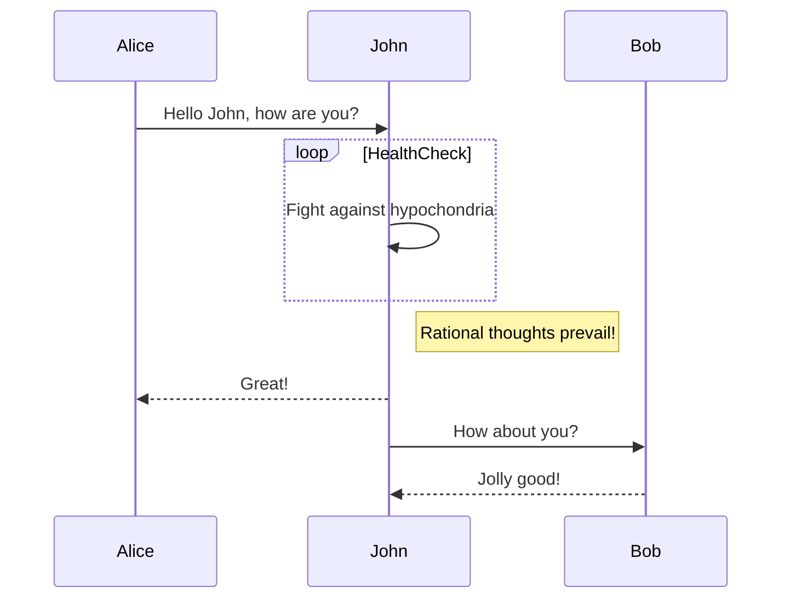

Hello World!
# Hello World!
## Hello World!
### Hello World!
#### Hello World!

My name is **YUAN WENTAI
😘**.I'm at UKM.
|No.|Name|Faculty|
|---|---|---|
1 | YUAN WENTAI | FTSM

:link:https://ukmfolio.ukm.my/

----------------------------------------------------------
This sequence diagram illustrates the interaction between Alice, John, and Bob, where John performs an internal health-check loop before responding and continuing the conversation.

